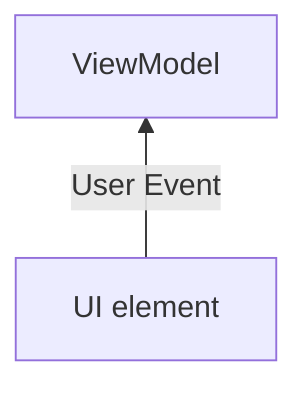
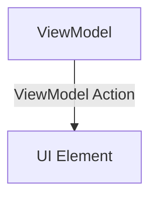
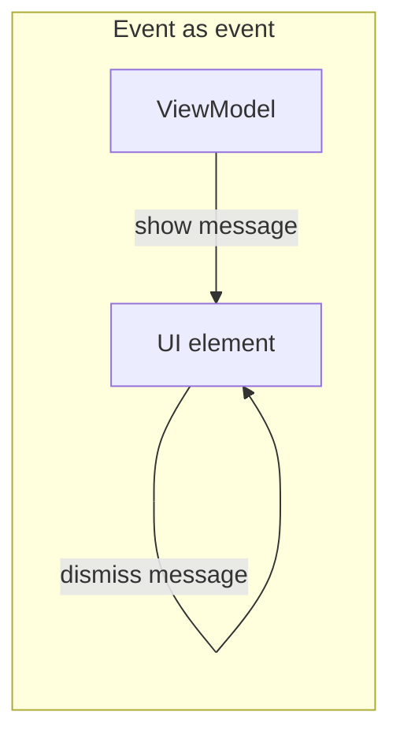
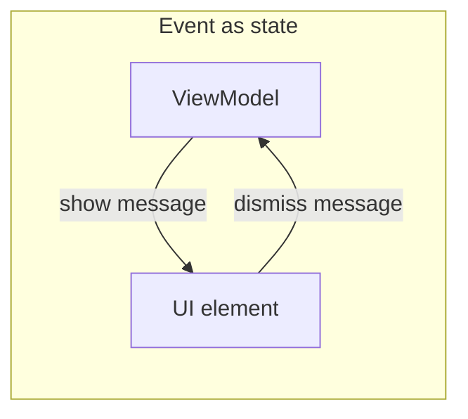

---
tags:
  - android
  - compose
  - ui
publish: true
---
# [Docs : UI Events](https://developer.android.com/topic/architecture/ui-layer/events?_gl=1*19ya8mt*_up*MQ..*_ga*MTM4MzQ3NzUxMy4xNzc0MjQ3NDgx*_ga_6HH9YJMN9M*czE3NzQyNDc0ODEkbzEkZzAkdDE3NzQyNDc0ODEkajYwJGwwJGgxOTE3NjI5NTQ3)

> _UI events_ are actions that should be handled in the UI layer, either by the UI or by the ViewModel.

This document provides guide on how to handle UI events. 

## Types of UI events

Although the UI events are produced and consumed in UI layer, there are two types of events depending on where the event was produced.
### User events

Most common type of events are user events. The user produces events by interacting with the UI elements. 



The user event goes up from the UI element to the ViewModel, which is the state holder. This event only notifies that user did an action, and depends on the ViewModel to update the state.

```kotlin
@Composable
fun RequestButton(
	modifier: Modifier,
	onRequest: () -> Unit,
) {
	Button(
		onClick = onRequest, // produce event
	)
}
```

```kotlin
RequestButton(
	onRequest = { viewModel.request() } // ViewModel handling the event
)
```

## ViewModel events

The other type of UI events is the ViewModel events. These are the action produced by the ViewModel that handles non-user events, such as internet connection, async task result, to show dialogs, snackbars, toast, or customized UI for the event.


ViewModel events flows opposite of user event flow direction, going down from the ViewModel to UI element. Here, the quote comes to mind: '*Event goes up, state goes down*'.
### Event as state

The important point of the document is that the ViewModel event is delivered as UI state change. UI state is treated as the representation of the screen, including eventual popup messages.

```kotlin
PaymentUiState(
	// ...
	val errorMessage: List<Int>,
	val isLoading: Boolean,
)
```

The error message is wrapped with other UI states.

```kotlin
if(state.errorMessage.isNotEmpty()) {
	val errorMessageText = stringResource(state.errorMessage[0])
	LaunchedEffect(errorMessageText) {
		val snackbarResult = showSnackbar(
			message = errorMessageText
		)
		onErrorDismiss(errorMessageText)
	}
}
```

Then the state is handled inside UI element to consume and process the ViewModel event.

### Why state to hold event?

The document does not fully explain on why the ViewModel should be a state. It is possible to use channel, sharedflow with buffer, or other types of queue for ViewModel event and handle it separately.
#### Fire and forget?

The biggest difference between ViewModel events as state and other approaches is how the event is consumed. 

The ViewModel fire and forgets events and UI element consumes them. If the user dismiss the dialog, the ViewModel does not know. Because of this, the ViewModel is harder to fully control these events.


The state is delivered to the UI element, but the consumption is always done inside the ViewModel. It's the ViewModel that handles whether to show or hide the message. As the result, the screen can be restored including the message when UI elements were destroyed abruptly due to configuration changes or other reasons.
### Personal Thoughts

Even though event as state looks quite simple in the example, it's rather hard to design the UI state and event in development. As the screen gets complex, the harder for the developer to decide where to hold the state and event. Also, it's not easy for those not familiar to the Compose world, because the design decisions are totally different to the View system.

This complexity of the design can be overcome, if the developer understands the principle and makes decisions with reasoning. The reward will be a uni-directional data flow and fully managable UI with high scalablity, maintainability.

But this is not a solution for all situations. It depends on the team size, project, development time, and other many things. It's developer who should think about the trade-off and make a decision.


