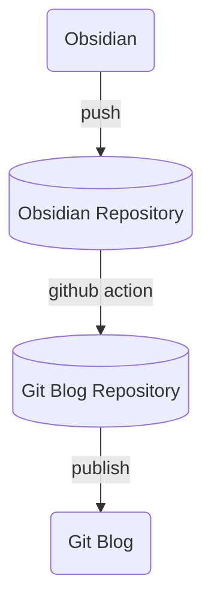

# 무엇을 쓰는 블로그인가?

이 곳은 자유롭게, 마치 일기장처럼, 기록을 남기기 위한 블로그이다. 나의 생각을 혼자 적어내려가는 것 또한 좋은 방법이지만, 누구나 그렇듯 사람은 자신을 알아주기를 원한다. 그렇기에 내가 남긴 발자취를 조금씩이라도 남겨보고자 만든 공간이다.

# 어떻게 시작되었는가?

기록은 언제나 가치를 지닌다. 특히나 개발자에게는 과거에 해결한 문제에 대해 기록을 남기는 것이 미덕으로 여겨진다. 그렇기에 내 주변의 많은 사람들처럼 나 또한 기록을 남기고자 하였다.

## 여러 서비스를 사용해보다
노트 정리, 블로그 서비스는 굉장히 많다. 그 중 나는 내 손에 맞는 것들을 찾아나가기 시작했다.
### Notion
첫 시작은 지금도 많이 쓰이고 있는 노션이었다. 원래는 프로젝트를 진행하며 문서를 관리하는 것으로 알게 되었지만, 개인적인 기록을 남기기에 워낙 좋은 도구이기에 빠르게 사용하기 시작했다.
그러나 노션은 블로그로써는 잘 쓰이지 않는다. 기록을 개인소장하거나 소규모 팀 단위에서 공유하는 것에 특화되어 있고, 외부인에게 폐쇄적이다. 개인적인 기록을 정리하는 용도로는 계속 사용했었지만, 자신을 좀 더 나타내기 위해서는 다른 서비스가 필요했다.

### Velog
그래서 찾은 것이 개발자들을 위한 블로그 서비스인 벨로그였다. 나는 블로그를 예쁘게 꾸미는 것에는 큰 관심이 없었고, 개발자로서 언젠가는 마크다운에 익숙해져된다 생각해 서비스를 선택했었다. 처음에는 익숙치 않은 마크다운에 글 작성이 어려웠지만, 어느새 적응을 할 수 있었고 벨로그를 통해 나는 마크다운과 친해질 수 있었다.

### Medium
벨로그도 좋았지만, 나는 좀 특이한 욕심이 있었다. 글을 영어로 쓰고 싶다는 것. 영작을 잘하는 것은 아니지만, 어릴 적부터 영어에 거부감이 없었다. 그리고 무엇보다 기술 블로그를 쓰다 주로 명사를 영어로 쓰고 조사를 한글로 쓰고 있는 나 자신을 발견하게 되면서 *'이럴꺼면 영어로 쓰고 말지'* 라는 생각이 든 것이다. 나는 한영키를 누르는 것이 귀찮았다.

원래 기술적인 트렌드를 따라가고 양질의 글을 보기 위해 '읽는' 용도로는 사용하고 있었으나 내가 거기에 글을 쓸거라고는 생각하지 않았었다. 그래도 벨로그에서의 경험으로 글 쓰기에는 큰 어려움이 없었고, 그즈음부터 성능이 비약적으로 높아진 AI의 도움으로 보다 풍부하게 표현을 쓸 수 있었다.

## AI의 출현
이제는 산업과 생황에서 AI는 깊숙히 자리를 잡았다. 그러면서 많은 것이 달라졌고, 나이 생각 또한 많이 변화하였다.

### 정보의 소유
이전에는 다른 서비스에 작성하는 기록들이 *'나의 것'* 으로 느꼈다면, AI가 등장하면서 이제는 나의 정보를 '위탁'하는 것처럼 느껴지기 시작했다. 혹자는 내가 작성한 정보들이 수집되고 학습되며 사용되는 것 때문이냐고 물을 것이다. 하지만 그것보다, 개발자로서, 나는 나의 기록을 온전히 사용하기 어렵다고 느꼈기에 그런 것이다.

노션을 예로 들어보자. 노션의 AI 기능은 노션 내부에 한정되어 있다. 내가 만든 노션 데이터베이스나 페이지를 외부 AI서비스에서 사용하고자하면 복사-붙여넣기, 내보내기를 하거나 API를 사용해야한다. 특히나 노션은 마크다운을 지원하지 않기 때문에 복사 붙여넣기로는 제대로 정보를 옮길 수 조차 없다. 어찌되었든 무엇을 하던지 번거롭기는 마찬가지다.
그나마 벨로그와 미디움은 마크다운을 지원하기에 나은편이지만, 오히려 블로그 서비스이기에 API를 별도로 지원하지 않는다는 단점또한 있다.

### Obsidian
*'어떻게하면 나의 기록을 온전히 내가 소유할 수 있을까?'* 를 고민하다 찾은 것이 바로 옵시디언이다. 마크다운 형식으로 글을 작성하고, 그 파일은 온전히 내가 관리할 수 있다. 서비스의 별도 API를 통해 기록을 접근할 필요도 없이 파일자체에 내가 직접 접근할 수 있다.

내가 파일을 직접 관리할 수 있다는 것은 지금에 들어서는 굉장한 메리트를 가진다. AI 에이전트가 일반화된 지금, *'맥락(Context)'* 은 굉장한 의미를 가진다. 그리고 그 맥락을 전달하기 가장 좋은 방식이 에이전트에게 파일을 제공하는 것이다. 그렇기에 나의 기록을 온전히 소유할 수 있는 옵시디언을 나는 꾸준히 사용하고 있다.

### Git Blog
하지만 노션의 문제와 마찬가지로, 옵시디언은 블로그 서비스가 아니다. 심지어는 로컬에서 동작하는 것이기 때문에 블로그를 만드려면 별도의 호스팅이 필요하다. 그렇다고 기존의 웹 블로그 서비스를 사용하자니 온전히 소유하는 느낌이 들지 않았다.

그래서 찾은 것이 깃 블로그였다. 깃 블로그는 호스팅을 깃헙에서 하면서, 그 안에 들어가는 모든 포스트들은 내 레포지토리에서 관리할 수 있다. 다른 블로그 서비스들처럼 커뮤니티 기능은 없지만, 내가 원하는대로 블로그의 정보를 다룰 수 있다는 것이 다른 모든 단점을 상쇄할 수 있었다.

#### Quartz
깃 블로그에 사용하는 프레임워크는 꽤나 다양하다. 그 중에서 내가 고른 것은 바로 옵시디언 친화적인 쿼츠다. 애초에 옵시디언 노트를 웹에 게시하기 위해 만들어졌기 때문에 옵시디언 특유의 그래프 뷰도 지원을 하며, 기존 옵시디언 노트를 작성하는 것처럼 글을 작성할 수 있다. 지금 이 글도 옵시디언에서 작성한 것이다.

# 어떻게 사용되는가?
이제 정보를 *'풀소유'* 하기 위해 옵시디언으로 기록을 관리하고 포스팅할 깃블로그를 만들어졌다는 것을 알게되었을 것이다. 하지만, 여기에는 또 다른 비밀이 있다.

## 정보의 분리
그저 생각나는 것을 써내려가는 것과 다른 사람들에게 보여지는 글은 분명히 구분되는 경계가 있다. 그렇다고 옵시디언에 쓸 때마다 신경 쓰며 쓰고 싶지도, 무분별하게 쓴 기록을 그대로 깃 블로그에 업로드하고 싶지 않았다.

그래서 내가 선택한 전략은 *'정보의 분리* 다. 날 것의 기록들은 그대로 옵시디언에 저장하되, 그 중 내가 블로그에 남기고자 정제한 것 만을 깃 블로그에 올리는 것이다. 옵시디언과 깃 블로그는 별도의 레포지토리로 분리되어 각각 관리된다. 하나는 프라이빗하게, 하나는 퍼블릭하게.

그러나 레포지토리가 두 개가 되면서, 관리는 더 힘들어졌다. 만약 블로그 글을 작성할 때, 옵시디언과 깃블로그 두 레포에 모두 올릴 것인가? 아니면 깃블로그에만 올릴 것인가? 전자의 경우 옵시디언에 개인기록과 함께 블로그 글도 같이 관리되어 '맥락'을 유지하는데 도움이 된다. 하지만 매번 두 레포에 커밋하는 것은 상당히 귀찮은 일이다. 그렇다고 깃블로그에만 올리자니 '맥락'이 분산되어버린다.

## 자동화
답은 자동화에 있었다. '귀찮은 일'을 더이상 귀찮지 않게만 한다면 모든 문제는 해결된다. 그리고 우리에게는 Github Action이라는 좋은 자동화 도구가 존재한다.

1. 옵시디언 노트를 작성하고 `publish`를 `true`로 설정한다.
2. 옵시디언 레포에 푸시한다.
3. 깃헙 액션으로 `publish`값이 `true`인 노트만을 선별한다.
4. 깃 블로그 레포지토리에 노트를 푸시한다.
5. 깃 블로그에 퍼블리싱 된다.

깃헙 액션을 통해 블로그에 글을 쓰는 프로세스는 깃 블로그 하나에만 커밋하는 것과 같아졌다. 마크다운 파일로 기록을 관리하면서도 자동화를 통해 관리의 불편함을 해소한 것이다. 

# 블로그의 의의
AI의 시대에 정보란 곧 결과물의 품질을 결정하는 자산이 되었다. 그렇기에 정보를 제어하는 것이 어느 때보다 중요해졌다. 그리고 그 정보를 내 관리 하에 두기 위해 내가 고민한 결과물이 바로 이 블로그이다. 